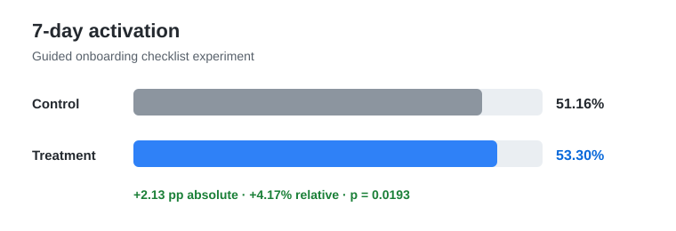

<h1 align="center">Product Analytics Case Study</h1>

<p align="center">
  Experiment design, integrity diagnostics, event analytics, SQL, statistical inference, data-quality gates, and a decision-ready product readout.
</p>

<p align="center">
  <a href="https://github.com/gultekinhasancan79/product-analytics-case-study/actions/workflows/ci.yml"></a>
  
  
  
  
  
  
</p>

---

## Executive Summary

This repository is an end-to-end **product analytics and experimentation case study** built around a fictional SaaS onboarding experiment.

The product team is testing a **guided onboarding checklist** against the existing onboarding flow:

> Does guided onboarding increase the share of new users who reach activation within seven days, without increasing support burden?

The analysis uses a deterministic synthetic dataset of **12,000 randomized signups** plus a deterministic **41,209-row product-event fact table**, so the experiment and event-analysis results can be regenerated from source.

### Decision

**Ship the treatment**, while treating the weaker mobile response as a follow-up hypothesis rather than a confirmed heterogeneous effect.

| Metric | Control | Treatment | Lift | Statistical read |
| --- | ---: | ---: | ---: | --- |
| **7-day activation — primary** | 51.16% | 53.30% | **+2.13 pp** | p = 0.0193; 95% CI +0.35 to +3.92 pp |
| 14-day retention | 39.34% | 42.52% | **+3.18 pp** | p = 0.0004 |
| Support ticket within 7 days — guardrail | 9.94% | 8.53% | **-1.41 pp** | p = 0.0077 |
| Mean 30-day revenue / signup | $21.42 | $22.94 | +$1.52 | descriptive |
| Mean time-to-value among activated users | 20.15 h | 17.77 h | -2.38 h | descriptive |

<p align="center">
  
</p>

### Experiment health

The positive result is not interpreted before checking assignment integrity:

- **6,024 control / 5,976 treatment**
- **SRM p = 0.6613** — no evidence of allocation mismatch
- **max pre-treatment standardized difference = 0.028** — below the 0.10 review threshold
- **planning MDE = 3.0 pp** at 80% power / alpha 0.05 → about **8,694 required users**
- **realized 12,000-user MDE ≈ 2.55 pp** at the observed control baseline

These calculations come from `src/diagnostics.py`; they are not manually typed statistical claims.

---

## Product & Experiment Context

### Product

A fictional B2B analytics product where new users typically need to:

1. connect a data source,
2. create their first dashboard,
3. reach a useful first outcome,
4. and return after onboarding.

### Treatment

The treatment adds a guided checklist that makes the critical setup steps explicit and keeps onboarding progress visible.

### Experiment contract

- **Unit of randomization:** signup / user
- **Allocation:** approximately 50/50 control vs treatment
- **Primary metric:** 7-day activation
- **Secondary metric:** 14-day retention
- **Guardrail:** support ticket within seven days
- **Planning MDE:** 3.0 percentage points
- **Power:** 80%
- **Primary test:** two-sided two-proportion z-test, alpha = 0.05
- **Integrity checks:** sample-ratio mismatch + pre-treatment balance
- **Exploratory:** device/channel, event funnel, cohort, time-to-value, revenue
- **Data:** deterministic synthetic data; no real customer information

See [`docs/experiment_design.md`](docs/experiment_design.md) for the analysis contract and [`docs/metric_definitions.md`](docs/metric_definitions.md) for the data model.

---

## Heterogeneity Diagnostic

The overall treatment wins, but the device split is not uniform:

| Device | Control activation | Treatment activation | Lift |
| --- | ---: | ---: | ---: |
| Desktop | 54.64% | 58.15% | **+3.51 pp** |
| Mobile | 45.68% | 45.90% | **+0.23 pp** |

Instead of claiming subgroup heterogeneity because one point estimate is larger, the project computes a formal interaction contrast:

**desktop-minus-mobile treatment-lift difference = +3.28 pp · p = 0.0773 · 95% CI -0.36 to +6.93 pp**

That is suggestive, but not conclusive at alpha = 0.05. A mobile onboarding usability investigation is justified; a strong causal subgroup claim is not.

---

## Data Model

The project deliberately contains both a randomized-user table and a product-event table.

```text
product_users                         product_events
─────────────                         ──────────────
user_id  ───────────────────────────▶ user_id
variant                               event_id
device                                event_name
acquisition_channel                   event_ts
activated_7d                          event_value
retained_14d
support_ticket_7d
revenue_30d
```

`src/generate_dataset.py` creates the experiment-level outcomes. `src/generate_events.py` then materializes deterministic product events such as `signup`, `data_connected`, `dashboard_created`, `support_ticket_opened`, and `active_day_14`.

This lets the portfolio demonstrate both **experiment readouts** and **event-style funnel / timing analytics**.

---

## Analysis Layers

### Experimentation / Python

The Python layer covers:

- deterministic experiment generation,
- sample-ratio mismatch checks,
- pre-treatment randomization balance,
- pre-analysis sample-size / MDE planning,
- primary / secondary / guardrail metrics,
- two-proportion hypothesis tests,
- confidence intervals,
- formal treatment × device interaction analysis,
- and reproducible Markdown report generation.

The statistical implementation uses the Python standard library so the formulas remain inspectable rather than hidden behind a large framework.

### Product SQL

The SQL layer contains executable queries for:

- user-level activation funnel readouts,
- experiment KPI tables,
- device and acquisition-channel diagnostics,
- **event-based funnel conversion**,
- **weekly signup cohorts**,
- and **event latency from signup to dashboard creation**.

CI loads both generated tables into an in-memory relational database and executes every analytical SQL file.

### Data Quality

The validation layer checks both user-level and event-level contracts, including:

- required columns and valid domains,
- unique user and event identifiers,
- experiment dimensions,
- impossible funnel states,
- non-negative revenue,
- event → user referential integrity,
- expected event cardinality,
- event ordering,
- seven-day activation/support windows,
- and agreement between event presence and user-level metrics.

---

## Repository Structure

```text
.
├── .github/workflows/ci.yml
├── assets/
│   └── activation_result.svg
├── data/
│   └── README.md
├── docs/
│   ├── experiment_design.md
│   └── metric_definitions.md
├── reports/
│   └── experiment_summary.md
├── sql/
│   ├── 00_schema.sql
│   ├── 01_activation_funnel.sql
│   ├── 02_experiment_readout.sql
│   ├── 03_device_diagnostics.sql
│   ├── 04_channel_diagnostics.sql
│   ├── 05_event_funnel.sql
│   ├── 06_weekly_cohort.sql
│   └── 07_event_latency.sql
├── src/
│   ├── data_quality.py
│   ├── diagnostics.py
│   ├── experiment.py
│   ├── generate_dataset.py
│   ├── generate_events.py
│   └── run_sql.py
└── tests/
    └── test_pipeline.py
```

---

## Reproduce the Case Study

Requires Python 3.11+ and no third-party Python packages.

```bash
python -m src.generate_dataset
python -m src.generate_events
python -m src.data_quality
python -m src.experiment
python -m src.run_sql
python -m unittest discover -s tests -v
```

Generated data and temporary outputs are written under `artifacts/` and excluded from version control.

The committed [`reports/experiment_summary.md`](reports/experiment_summary.md) is a reproducibility target: CI regenerates the report from seed and fails if the output drifts.

---

## What CI Proves

Every pull request:

1. compiles the Python sources,
2. regenerates the 12,000-user experiment,
3. regenerates the 41,209-row event fact table,
4. validates user and event data contracts,
5. regenerates experiment health + statistical evidence,
6. diffs the generated report against the committed decision artifact,
7. executes every analytical SQL query,
8. and runs the expanded unit-test suite.

This prevents the portfolio narrative from silently diverging from the code or generated evidence.

---

## Limitations

This is a **synthetic case study**, not evidence from a live production experiment. The data-generating process intentionally contains treatment effects so the repository can demonstrate a complete analytics workflow.

The generated event timestamps are a deterministic analytical representation of the synthetic user outcomes; they are not independent production telemetry. In a live system, event instrumentation, exposure logging, identity resolution, late-arriving events, bots, retries, and missing telemetry would require additional validation.

Revenue and time-to-value remain supporting / descriptive metrics rather than additional confirmatory hypotheses. The device interaction is explicitly reported as exploratory because its p-value does not cross the prespecified 0.05 threshold.

---

## Next Extensions

- add a simulated pre-period covariate and **CUPED-style variance reduction**,
- add uncertainty analysis for skewed revenue using bootstrap or robust methods,
- add a notebook-oriented reviewer walkthrough when the repository workflow supports it cleanly,
- add exposure logging / intent-to-treat vs treatment-on-treated examples,
- and build a second case study focused on retention / lifecycle analysis rather than experimentation.

## License

MIT